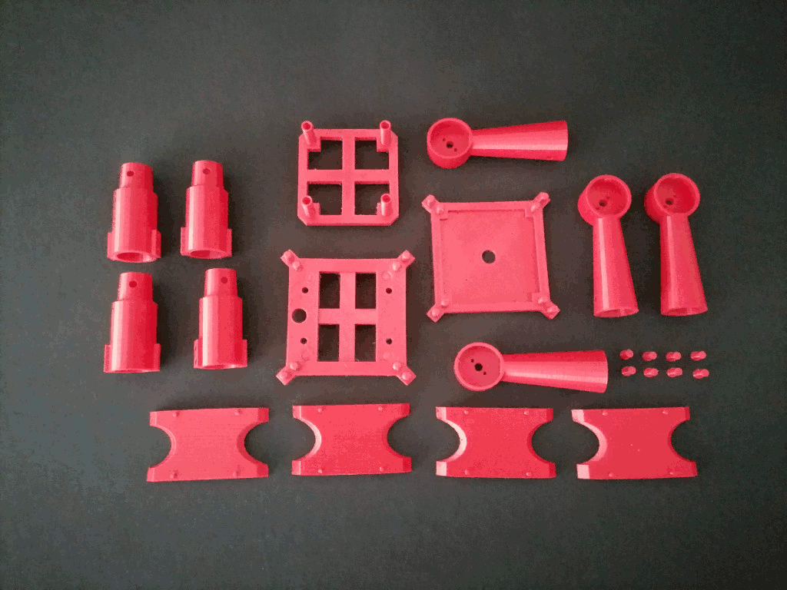

# Open Copter

Open Copter is a modular and scalable drone prototype. Quick and easy to assembly without no tools. Each of its modules can be designed for being compatible with multiple brushless motors, electronic speed controllers (ESC) or some flight controller boards.  
Check out the project web page for more details: <a href="https://saandial.github.io/opencopter" target="_blank">Open Copter</a> 

    

