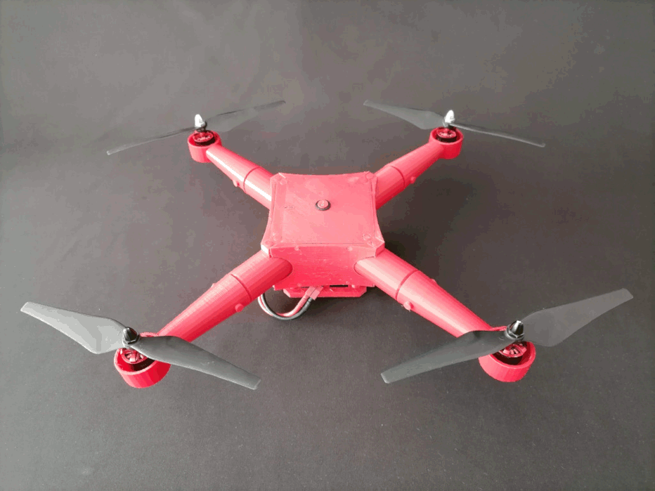
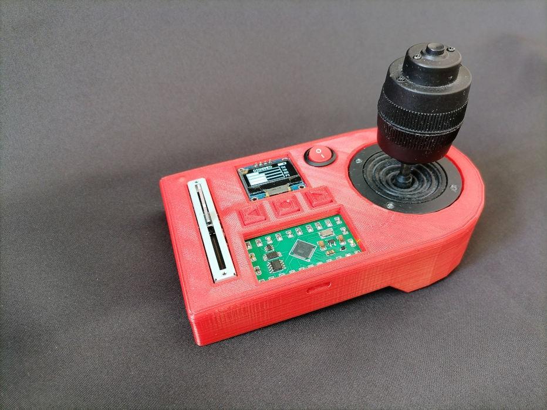

# Open Copter: modular and scalable drone (Work in Progress...)<br>

Open Copter is a modular and scalable drone. It's designed for building quickly and easily, no tools are needed.

## How it started?
### (By fires)

<div align="left">
    
    <p>Gif source: <a href="https://giphy.com/gifs/fire-seinfeld-15a78dCc2ESIw" target="_blank">Giphy</a>
</div>
When I started to build the first open copter prototype, my first steps as drone maker was a little bit rocky. Many of unexpected things happened. First of all my first prototype just caught on fire when I powered on by connecting the battery. I saw a black smoke to come out of the frame, so after this first wrong experience, I understood what I shouldn’t do. Don't use wires with the wrong size. The thickness of my wires was too tiny for the load. Be careful by using the appropriate size of wires for the current of the battery.

### (And crashes)

My next prototype was better designed (good size of wires), no smoke came out of the frame this time. After checking out of the ESC calibration, propellers orientation and some parameters. I decided to test the prototype outside to see if it could fly. Unfortunately, the reality was not that I expected, again. Just after armed the drone, it started to fly, I was so happy to see my first flight. But after a few seconds one of the brushless motors came off of the frame and the drone just crashed on the floor.
<br/>
<div align="left">
    
</div>
<br>
After several failed tests by improving the frame design, checking some parameters and motors stabilisation, I had enough experience to build one better. 
<br>


<div>
   <video style="display:block; width:100%; height:auto;" autoplay="true" controls="" loop="loop">
       <source src="[src/videos/demopark.mp4](https://raw.githubusercontent.com/saandial/Open-Copter/main/src/videos/demopark.mp4)" type="video/mp4" />
   </video>
</div>
<br>             
<div>
   <video style="display:block; width:100%; height:auto;" autoplay="" controls="" loop="loop">
       <source src="./images/demobeach.mp4" type="video/mp4" />
   </video>
</div>  

<div align="left">
    
    
</div>

## Electronics

- [opencopter-electronics](https://github.com/saandial/Open-Copter/tree/main/electronics): Electronics for Open Cotper. Include schematics and other diagrams.

## Software

- [opencopter-software](https://github.com/saandial/Open-Copter/tree/main/software): Source code files for transmitter and receiver.

## Hardware

- [opencopter-hardware](https://github.com/saandial/Open-Copter/tree/main/hardware): Hardware for Open Copter. Include STL file parts and other diagrams.

## Contributing

If you have a suggestion that would make this better, please fork the repo and create a pull request. You can also simply open an issue with the tag "enhancement".
Don't forget to give the project a star! Thanks again!

1. Fork the Project
2. Create your Feature Branch 
```bash
git checkout -b feature/AmazingFeature
```
3. Commit your Changes
```bash
git commit -m 'Add some AmazingFeature'
```
4. Push to the Branch 
```bash
git push origin feature/AmazingFeature`
```
5. Open a Pull Request

## How to build

If you want to know more about how to assembly the Open Copter, please checkout the github page: <br>
<a href="https://saandial.github.io/opencopter/index.html" target="_blank">https://saandial.github.io/opencopter/index.html</a>

## License

Distributed under the MIT License. See `LICENSE.txt` for more information.

## Contact

For any feedback please contact me: <br>
Almoutazar SAANDI - almoutazar(dot)saandi(at)gmail(dot)com

