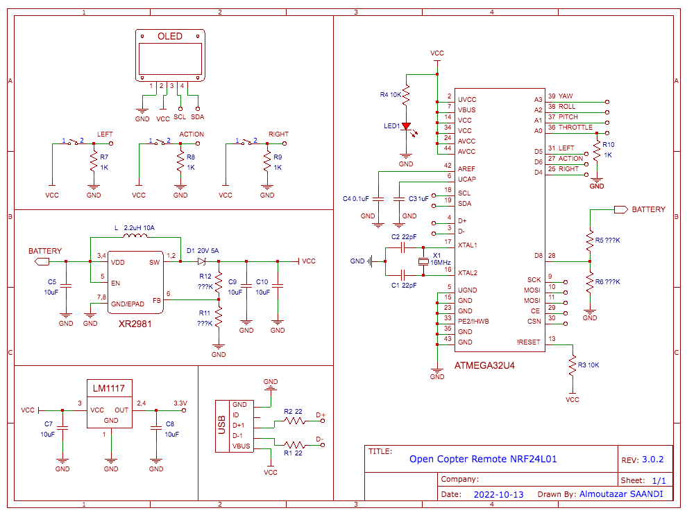

https://user-images.githubusercontent.com/17693496/223571099-8ab36836-5051-4212-8d18-066a596307e5.mp4

# Open Copter: modular and scalable drone (Work in Progress...)<br>

<div align="center">
    <p>Open Copter is a modular and scalable drone. It's designed for building quickly and easily, no tools are needed.</p>
    
    
</div>

## How it started?
### By struggling with fires:

<!--div align="left">
    
    <p>Gif source: <a href="https://giphy.com/gifs/fire-seinfeld-15a78dCc2ESIw" target="_blank">Giphy</a>
</div-->
When I started to build my first open copter prototype it was a little bit rocky. Many of unexpected things happened. First of all my first prototype just caught on fire when I powered on by connecting the battery. I saw a black smoke to come out of the frame, so after this first wrong experience, I understood what I shouldn’t do. Don't use wires with the wrong size. The thickness of my wires was too tiny for the load. Be careful by using the appropriate size of wires for the current of the battery.

### And crashes:

My next prototype was better designed (good size of wires), no smoke came out of the frame this time. After checking out of the ESC calibration, propellers orientation and some parameters. I decided to test the prototype outside to see if it could fly. Unfortunately, the reality was not that I expected, again. Just after armed the drone, it started to fly, I was so happy to see my first flight. But after a few seconds one of the brushless motors came off of the frame and the drone just crashed on the floor.
<br/>
<div align="left">
    
</div>
<br>
After several failed tests by improving the frame design, updating some parameters and working on motors stabilisation, I did enough of mistakes to hope building a better one. 
<br>

## Frame assembling (working progress)
<div align="center">
    
</div>
<div align="center">
    <p>Very easy assembling no tools are needed</p>
    
</div>
<br>
<div align="center">
    
    
    
    
    
    
</div>
<br>

* **Weight (empty)**: 300g
* **Diagonal (motor-to-motor)**: 460mm
* **Number of parts**: 47
* **Material**: PLA flexible 

All the frame parts have been designed for making the drone scalable and modular. Each of them could be replaced to customize the drone as it needs. 
The frame could be entirely 3D printed. For better frame assembling its highly recommended to use the PLA flexible material to print the parts. 
STL files are available here: <a href="https://github.com/saandial/Open-Copter/tree/main/frame_design" target="_blank">frame design</a> (coming soon)

## Transmitter (working progress)

<div align="center">   
     
</div>
<br>

* **Microcontroller**: ATmega32u4
* **Screen**: Oled 128x64
* **Potentiometer**: 3 axis
* **Port**: Micro USB port
* **Module transceiver**: Mini NRFL4L01 

<div align="center">
    
    
    
</div>

### Electonics remote:
<div class="center">   
     
</div>

### Software remote:
(comming soon)

## Contributing

If you have a suggestion that would make this better, please fork the repo and create a pull request. You can also simply open an issue with the tag "enhancement".
Don't forget to give the project a star! Thanks again!

1. Fork the Project
2. Create your Feature Branch 
```bash
git checkout -b feature/AmazingFeature
```
3. Commit your Changes
```bash
git commit -m 'Add some AmazingFeature'
```
4. Push to the Branch 
```bash
git push origin feature/AmazingFeature`
```
5. Open a Pull Request

## License

Distributed under the MIT License. See `LICENSE.txt` for more information.

## Contact

For any feedback please contact me: <br>
Almoutazar SAANDI - almoutazar(dot)saandi(at)gmail(dot)com

